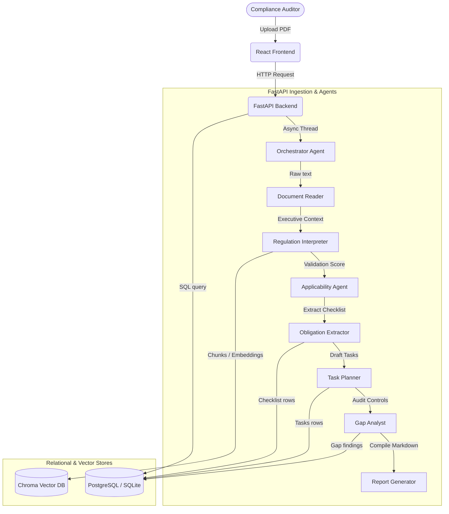

# System Architecture - Agentic Compliance Hub

This document details the software architecture, agent execution sequence, and RAG retrieval pipelines that power the Agentic Compliance Hub.

## 1. High-Level Block Diagram

---

## 2. Ingestion Multi-Agent Pipeline

When a user uploads a new regulatory document, the backend initiates an asynchronous pipeline led by the `ComplianceOrchestrator`:

1. **Document Ingestion (`DocumentReaderAgent`)**:
   - Parses the document layout page-by-page.
   - Cleans duplicate characters, whitespace, and layout noise.
   - Runs OCR fallbacks if text extraction is empty.

2. **RAG Vectorization (`RAGPipeline`)**:
   - Divides text content into overlapping chunks.
   - Computes semantic embeddings for chunks.
   - Persists data to the Chroma DB / local fallback vector store.

3. **Context Summary (`RegulationInterpreterAgent`)**:
   - Synthesizes executive summaries, affected actors, and timelines.

4. **Relevance Screening (`ApplicabilityAgent`)**:
   - Compares regulation scope with the corporate business profiles.
   - Halts execution if non-applicable (marking it as processing completed without tasks creation).

5. **Directives Extraction (`ObligationExtractorAgent`)**:
   - Scans text for compliance obligations, deadlines, and penalty clauses.

6. **Workflow Scheduling (`TaskPlannerAgent`)**:
   - Creates actionable check tasks for each obligation and maps timelines.

7. **Controls Review (`GapAnalysisAgent`)**:
   - Compares active obligations with current operational tasks to detect gaps.

8. **Audit Export (`ReportGeneratorAgent`)**:
   - Compiles findings into an audit-ready Markdown report saved to disk.
