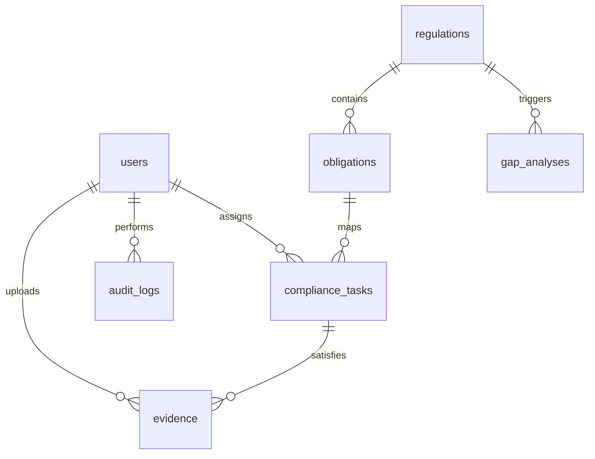

# Database Schema - Compliance Hub

This document defines the tables, data types, and foreign key relations inside the Relational Database (PostgreSQL / SQLite).

---

## 1. Table Definitions

### `users`
Represents compliance officers, auditors, and administrators.
- `id` (INTEGER, Primary Key): Unique auto-increment identifier.
- `username` (VARCHAR(100), Unique): Login name.
- `email` (VARCHAR(255), Unique): Registered email address.
- `password_hash` (VARCHAR(255)): Bcrypt hashed password.
- `role` (VARCHAR(50)): Roles list: `Admin`, `Compliance_Officer`, `Auditor`.
- `created_at` (TIMESTAMP): User creation date.

### `regulations`
Parsed circulars and regulatory directives.
- `id` (INTEGER, Primary Key): Unique auto-increment identifier.
- `title` (VARCHAR(255)): Circular heading.
- `description` (TEXT): Executive summary generated by agents.
- `source` (VARCHAR(100)): Issuing authority (e.g., SEBI, RBI).
- `category` (VARCHAR(100)): Segment categorization.
- `reference_url` (VARCHAR(500)): Link to source circular.
- `published_date` (DATE): Release date of the regulation.
- `file_path` (VARCHAR(500)): Local upload location path.
- `status` (VARCHAR(50)): `Pending`, `Processing`, `Processed`, `Error`.
- `processed_at` (TIMESTAMP): Completed analysis timestamp.

### `obligations`
Granular directives extracted by agents.
- `id` (INTEGER, Primary Key): Unique auto-increment identifier.
- `regulation_id` (INTEGER, Foreign Key -> `regulations.id`): Circular source.
- `title` (VARCHAR(255)): Short description label.
- `description` (TEXT): Strict compliance requirement text.
- `section_reference` (VARCHAR(150)): Reference section matching the source text.
- `compliance_deadline` (DATE): Audit deadline date.
- `penalty_description` (TEXT): Fine or breach details.
- `risk_level` (VARCHAR(50)): `High`, `Medium`, `Low`.

### `compliance_tasks`
Operational control actions scheduled to resolve obligations.
- `id` (INTEGER, Primary Key): Unique auto-increment identifier.
- `obligation_id` (INTEGER, Foreign Key -> `obligations.id`): Mapped obligation.
- `title` (VARCHAR(255)): Action heading.
- `description` (TEXT): Audit checklist directives.
- `assigned_to` (INTEGER, Foreign Key -> `users.id`): Assigned compliance officer.
- `due_date` (DATE): Due calendar date.
- `status` (VARCHAR(50)): `Pending`, `In_Progress`, `Under_Review`, `Completed`.
- `priority` (VARCHAR(50)): `High`, `Medium`, `Low`.

### `evidence`
Proof documents uploaded to clear scheduled tasks.
- `id` (INTEGER, Primary Key): Unique auto-increment identifier.
- `task_id` (INTEGER, Foreign Key -> `compliance_tasks.id`): Linked task.
- `title` (VARCHAR(255)): Description.
- `file_path` (VARCHAR(500)): File storage path.
- `uploaded_by` (INTEGER, Foreign Key -> `users.id`): Uploading user.
- `status` (VARCHAR(50)): `Pending_Review`, `Approved`, `Rejected`.
- `comments` (TEXT): Officer remarks/objections.
